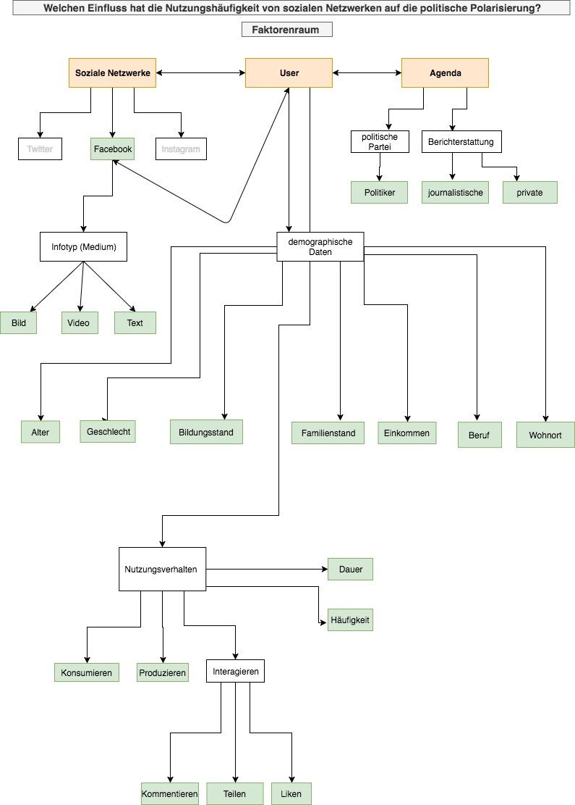

# Politisierung

In diesem Forschungsprojekt soll es um den möglichen Einfluss der Nutzungshäufigkeit sozialer Netzwerke auf den persönlichen politischen Entwicklungsprozess gehen. 

### Teammitglieder

Nils Rusch 
Samira Naumann
Lena Lange
Tanin Sohi
Isabelle Kricsfalussy-Hrabar
Janina Bleeck

## Forschungsfrage

Welchen Einfluss hat die Nutzungshäufigkeit von sozialen Netzwerken auf die politische Polarisierung?

## Faktorenraum

